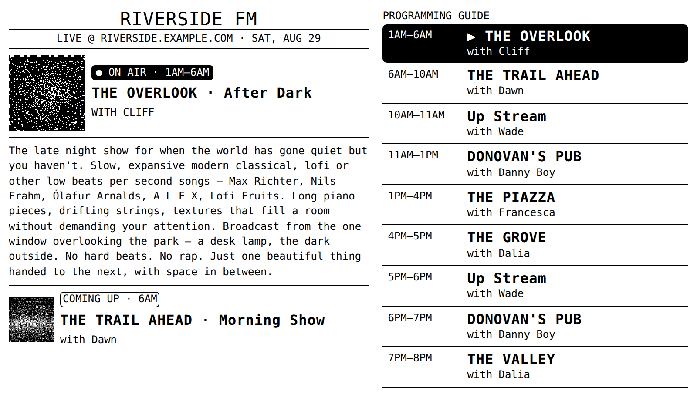
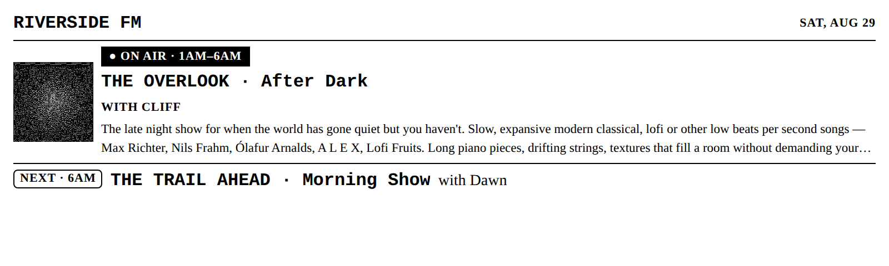
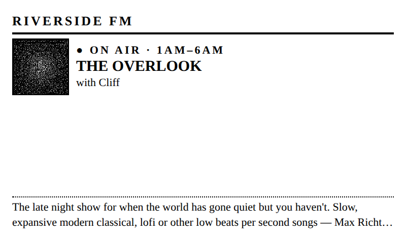
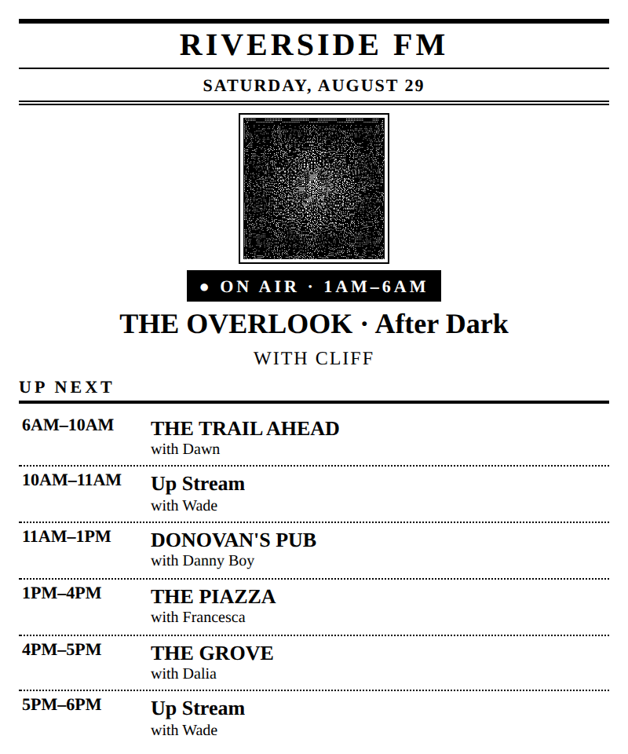

# SUB/WAVE Radio for TRMNL

A TRMNL plugin that shows what's on air, who's hosting, and the rest of the day's
programming for any self-hosted [SUB/WAVE](https://www.getsubwave.com/) internet
radio station.

Paste your station URL. Everything else — station name, tagline, DJs, artwork,
the full 7×24 schedule — is read from your own station's API. No account, no API
key, no third-party service in the middle.



## Requirements

- A SUB/WAVE station reachable from the public internet. TRMNL fetches the data
  from its own servers, so a LAN address or a `.local` hostname will not work.
- Nothing else. SUB/WAVE serves `/api/schedule` and `/api/now-playing` with open
  CORS and no authentication.

## Install

**From the TRMNL recipe list** — search Recipes for "SUB/WAVE Radio" and click
Install. Then set your Station URL (below).

**From source** — clone this repo and push it to your own private plugin:

```sh
git clone https://github.com/mrain1p/subwave-trmnl-display.git
cd subwave-trmnl-display
gem install trmnl_preview
trmnlp login          # or export TRMNL_API_KEY=...
```

Change `id:` at the top of `src/settings.yml` to your own plugin's id — or delete
the line to create a new one — then `trmnlp push`.

## Configuration

Only the first field is required.

| Field | Type | What it does |
| --- | --- | --- |
| **Station URL** | url | Your station's public origin, e.g. `https://radio.yourstation.com`. **No trailing slash.** |
| **Station Name** | string | Overrides the wordmark. Blank uses the name your station reports. |
| **Masthead Subtitle** | string | The line under the wordmark. Blank uses your station's tagline; type your own to show a web address. |
| **Station UTC Offset** | number | Only needed if your TRMNL sits in a different time zone than the station. See [Time zones](#time-zones). |
| **DJ Artwork** | select | Dithered / High contrast / Outlined / Hidden. Dark art dithers into noise on 1-bit panels &mdash; see [DJ artwork](#dj-artwork). |
| **Show Description Size** | select | Large / Normal / Small. Sets type size and how many lines fit before the description ellipses. |
| **Programming Guide Length** | number | 3–14 blocks in the guide column on the full layout. |

## Layouts

All four TRMNL layouts are implemented.

| | |
| --- | --- |
| **Half horizontal** — 800×240 | **Quadrant** — 400×240 |
|  |  |

**Half vertical** — 400×480



## How it works

The plugin polls two endpoints and merges them:

```
{{ station_url }}/api/schedule      → shows, personas, the 7×24 grid
{{ station_url }}/api/now-playing   → station name and tagline
```

TRMNL exposes the merged payloads as `IDX_0` and `IDX_1`. The templates walk the
grid to find the block covering the current hour, merge runs that cross midnight,
and skip unscheduled hours rather than rendering an empty panel.

There is deliberately **no "now playing" track line.** TRMNL's fastest refresh is
15 minutes, so a track name on an e-ink panel is wrong more often than it's right.
That space goes to the show description, which stays true for the whole block.
`/api/now-playing` is still polled — `dj.station` and `dj.tagline` are what let the
masthead configure itself.

## Local development

```sh
export STATION_URL=https://radio.yourstation.com
bin/trmnlp serve
```

Open <http://localhost:4567>. `bin/trmnlp` uses the Ruby gem if you have it and
falls back to the Docker image if you don't. Edit anything in `src/` and the
preview reloads.

## Deploying from GitHub

Create `.github/workflows/trmnl.yml` with the following. It lints every pull
request and pushes to TRMNL on every commit to `main`:

```yaml
name: TRMNL

on:
  pull_request:
  push:
    branches: [main]

jobs:
  lint:
    runs-on: ubuntu-latest
    steps:
      - uses: actions/checkout@v4
      - uses: ruby/setup-ruby@v1
        with:
          ruby-version: "3.4"
      - run: gem install trmnl_preview
      - run: trmnlp lint

  push:
    needs: lint
    if: github.ref == 'refs/heads/main'
    runs-on: ubuntu-latest
    steps:
      - uses: actions/checkout@v4
      - uses: ruby/setup-ruby@v1
        with:
          ruby-version: "3.4"
      - run: gem install trmnl_preview
      - run: trmnlp push --force
        env:
          TRMNL_API_KEY: ${{ secrets.TRMNL_API_KEY }}
```

Then add one repository secret:

> Settings → Secrets and variables → Actions → New repository secret
> **Name** `TRMNL_API_KEY` **Value** your key from TRMNL account settings

The push targets the plugin id in `src/settings.yml`. **If you forked this repo,
change that id first** — otherwise CI pushes at a plugin your key doesn't own and
fails.

## Notes and limits

### Time zones

SUB/WAVE publishes the schedule grid in station-local time and reports its IANA
zone in the payload, but TRMNL's Liquid has no filter that converts an IANA zone
to a UTC offset. The plugin therefore renders in **the TRMNL device's own time
zone**, which is correct when you're running your own station at home. If your
panel lives somewhere else, set Station UTC Offset by hand.

The clean fix is upstream: if `/api/schedule` also returned a numeric
`utcOffset`, the template could read it and the field could disappear.

### Trailing slashes

Field values are interpolated into the polling URL verbatim, and `` tags
don't execute there, so the URL can't be normalised inside the plugin. A trailing
slash produces `//api/schedule` and a 404.

### DJ artwork

Persona artwork is loaded cross-origin from your station on every refresh. If
your server is slow or briefly down, you get an empty box.

A 1-bit panel dithers whatever you send it. Dark, low-contrast portraits turn
into noise, because a flat mid-dark region is the worst case for dithering: half
the pixels end up on. The **DJ Artwork** setting offers three treatments —
plain dithering, a contrast push that drives the background to solid black
before the panel dithers, and a hairline outline that separates the portrait
from the page.

The bigger win is upstream. `tools/dither_avatar.py` resizes to the exact
rendered size, hardens the tones and applies an Atkinson dither before the image
ever reaches TRMNL:

```sh
python tools/dither_avatar.py cliff.jpg cliff-88.png --size 88 --gamma 1.4
```

Atkinson propagates only 6/8 of the error and discards the rest, so it clips
toward pure black and white instead of spreading grey. That is what keeps a
small face readable.

## Changelog

See [CHANGELOG.md](CHANGELOG.md). Current release: **1.0.0**.

## License

[MIT](LICENSE).

SUB/WAVE is a project of [getsubwave.com](https://www.getsubwave.com/); this
plugin is an independent community contribution and is not affiliated with or
endorsed by it, or by TRMNL.
